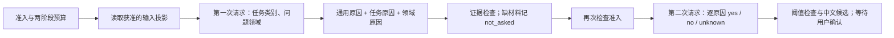

# 知因・Whynote

可审计的负反馈研究 PoC：先可靠保存点踩与用户亲选原因，再验证本机模型建议能否减少补写。模型推测永远不等于用户确认。

[产品 PRD](https://my.feishu.cn/wiki/XG6SwutL0i3fyWkwmhScEEB86Gg) · [技术文档](https://my.feishu.cn/wiki/GuphweJs3iWwBRkBDjlcljA16bh) · [开发规约](docs/development-governance.md) · [质量与剩余门槛](docs/quality-baseline.md)

## 安装与验证

Python 3.11；在核实版本的开发 checkout 中按锁文件安装。Windows 中文路径使用普通安装；源码修改后加 `--reinstall-package whynote`。该开发环境无需 Laya、PyTorch 或 CUDA。

```powershell
uv sync --extra dev --locked --no-editable
uv run --no-sync ruff check src tests integrations qa scripts/m55_window_validation.py
uv run --no-sync ruff format --check src tests integrations qa scripts/m55_window_validation.py
uv run --no-sync pytest tests qa/test_s0_regressions.py qa/test_manual_v1_acceptance.py -q
```

`uvicorn whynote.api:app` 默认拒绝业务请求，宿主须注入可信身份和对象权限。`python -m whynote.demo` 仅提供本机虚构页面。Open WebUI 的补丁、部署与原生测试见[宿主 README](integrations/openwebui/tests/README.md)。

## 功能与契约

| 功能 / 入口 | 必须保持的边界 |
| --- | --- |
| `POST /v1/feedback-actions`、`/{event_id}/retract`、`GET /{event_id}` | 动作与 Outbox 同事务；推断不阻塞点踩；事件只追加并可重放；动作撤销与推测失效分开 |
| `/{event_id}/attribution-events`、`whynote.measurement` | 来源、权限、对象版本、展示与幂等键绑定；选择/更正、都不是、跳过、拒填、关闭分别记录；无原因与用户选择 unknown 分开 |
| 本机 Laya、Jev 适配器 | 生产推断 Gate 允许路径仍以 `pipeline_unconfigured` 拒识；门控失败零上下文读取/模型调用。Laya 为未校准、未确认推测；Jev 凭据仅从本机私密引用读取 |
| `whynote.source_review`、`task_reasons`、`replay` | 合成映射、理由包和 A/B/C 诊断；反馈/gold 不进入预测材料；未知、无匹配与用户拒绝候选分开；旧合成入口不自动获得真实数据许可 |
| 建议与模板 / `research_report` | 生成、渲染、有效响应和确认分别计数；仅 yes/correct 形成确认。60 秒按可信回调到达时间判断，事务内仍复核撤权/撤销/换版/停用；零点击不确认 |
| `whynote.explore`、`controlled_replay`、`self_review` | 无标签探索与正式评测分开；探索结果不生成质量 PASS，不回填独立 gold，不直接用已暴露组作盲评留出 |

本机 Laya 的安装、启停和固定版本见[运行指南](docs/laya-local.md)。固定模型输入上限为 8192 UTF-8 字节 / 700 token，总预算 1024 token；超限拒绝，不静默截断。新理由 ID 不写回旧八类菜单。常规菜单“都不是”清空原因；模型建议组“都不是”拒绝该组，保留既有确认。

## TypeSafe 两层分类接口

研究结果契约 `jev-two-stage-v2` 对应 D-21、FR-05/06/14/15、TD-07/11/14；目录仍为 `jev-two-stage-v1`，86 项内容及 SHA-256 `09207682fc351519394a15c27ab4e0f5c4bac867e7b434a08d92ce129ef728ce` 不变。2026-10-05 只读核对飞书 PRD595 / 技术595；这里补充本地研究设计，不代表正式 taxonomy、阈值或生产验收。当前路线使用 TypeSafe/Jev；历史 Laya 代码和结果留作复现，开发环境无需 Laya、PyTorch 或 CUDA。



- 第一层有两个独立 Choice：`task` 与 `domain`，依据目标请求及其先前材料判断，不读取目标回答来决定任务。每轴选择一个主要类别；`mixed`、`other`、`unknown` 或未达显式阈值时，该轴不展开专属原因，只保留通用原因及另一已识别轴。此时结果范围为 partial，不能把它报告为所有原因均无匹配。
- 第二层的题目必须在第一层返回后构造；一个请求内并列的 Choice 不构成两层依赖。原因按目录顺序去重，每项独立返回 `yes/no/unknown`；不跨题比较概率选一个“主原因”。共享问题定义不复制到每个任务×领域组合中。
- 初版目录共 86 项原因：8 项通用、46 项任务原因、32 项领域原因。15 类任务覆盖代码生成/重构/排错、解释、求解、摘要、翻译、写作、抽取、分析、比较、计划、创作、工具执行、交流；16 个领域覆盖软件、数学数据、科学工程、医学健康、法律规则、金融商业、教育、语言、艺术文化、历史社会、职场、生活、旅行、人际、安全隐私、设计多媒体。数量只表示目录覆盖，不证明分类质量。
- `two_stage_catalog.json` 定义任务、领域、中文标签、判定条件和材料要求。`request`、`answer` 必须存在；可选字段仅为 `prior_context`、`original_code`、`source_text`、`reference`、`table`、`tool_trace`。调用者负责目标关联、脱敏、来源授权和只截取目标回答之前的材料；`feedback`、gold、事后批评和未来轮次不能进入投影。事实/专业知识核验必须有 `reference`，执行失败必须有 `tool_trace`，不能靠模型记忆或凭空假定已运行。
- 每项状态区分：`not_asked`（路由未选择或缺材料）、`unknown`（模型未知或阈值拒识）、`yes`、`no`。v1 的 `outcome` 继续原样保留用于追溯，包括缺材料时的旧 `unknown`；新版展示使用下表的 `assessment`，不能拿旧 outcome 与新版 assessment 的数量差宣称质量改善。

`summarize_assessment` 是核心分类、批摘要及历史派生共用的纯函数，汇总规则版本为 `jev-assessment-v1`：

| assessment | 固定语义 |
| --- | --- |
| `candidate_found` | 至少一个通过策略的 yes；允许同时存在材料缺口和路由不完整 |
| `no_issue_detected_in_evaluated_scope` | 至少问过一项，所有已问项最终均为 no；展示“已检查项未检出问题”并同时显示 `scope_notice` / coverage，不能写成“回答没有问题” |
| `abstained` | 没有 yes，至少一个已问项为 unknown |
| `not_evaluated` | 没有真正询问任何原因；空集合不能算全部 no |

技术 error、reconcile、excluded、pending 不应用上述判断，assessment/coverage 为 null。coverage 分别列出路由完整性与未确定轴、已问题数、**已选路由范围内**的缺材料题目与类型、路由未选择题目，以及逐题拒识的 `raw_unknown` / `probability` / `confidence` / `tie` 来源；来源可重叠。逐题 raw_choice、概率、confidence、not_asked 和多候选均保留，primary_reason=null、user_confirmed=false、attribution_source=model_inferred_unconfirmed。

接口为 `await whynote.two_stage.classify(state_factory, keys_file=..., policy=..., ...)`：

| 输入 / 输出 | 契约 |
| --- | --- |
| `enabled`、`outbound_approval_ref`、`admission_check` | 默认关闭；可信调用方提供实时准入函数，读取上下文前、每次发送前、返回后都须通过，撤销/到期不能继续第二层或展示建议 |
| `budget_reservations` | 必须提前为 `route`、`reasons` 各提供不同的预占引用；该接口不伪造预算批准或自动预占/结算 |
| `stage_callback` | 可选同步持久化回调，接收 `prepared/started/completed/failed` 与脱离内部对象的安全记录；`started` 回调成功返回后才发送，`completed` 在再次准入检查前保存用量。阶段记录仍为 `jev-stage-record-v2`，响应合法性、概率和容差规则不变 |
| `policy` | 必填带版本的路由/原因最小概率与 confidence；没有生产默认阈值，合成测试中的数值只用于验证门控行为 |
| 原生请求 | 固定 `jev-1.13.0` 和 TypeSafe 原生 endpoint；每层最多一次、无自动重试/重定向；单请求 JSON 上限 32768 UTF-8 字节，超限拒绝，不截断 |
| 返回 | 目录版本/hash、策略版本、两轴判断、完整逐原因状态、中文候选、逐阶段请求指纹/题目顺序/用量；不返回原始上下文、密钥或供应商原始错误正文 |
| 中途失败 | `StageError.stages` 保留已完成阶段的用量；`not_sent` 与 `failed_or_unknown` 分开，后者需要对账，不能按零费用自动重试；没有部分候选展示 |
| 展示 | `suggestions` 只含通过显式阈值的 yes，标记 `model_inferred_unconfirmed`、`user_confirmed=false`；`primary_reason=null`。中文文案来自固定目录，不生成自由文本诊断 |
| 兼容 | 新接口不改旧八类事件、`task_reasons` v1、`questions('original')` 四题及旧批次。它未接生产 Outbox 或宿主确认端点，不能把新 ID 写入旧菜单；未来接入须另验展示/确认版本绑定 |

先用 `tests/test_two_stage.py` 的虚构输入、假密钥和 MockTransport 验证两次原生请求。实际模型的路由准确率、逐原因误报/漏报、校准、用户确认效用要在此接口稳定后另行测试；本轮不运行付费 API，不给无 gold 的数据计算准确率。

原生 Choice 字段与响应校验依据 [TypeSafe API](https://docs.typesafe.ai/api)。生产上下文、auto-attach、自由文本 SLM 和训练导出继续关闭。

## 新版三源两阶段批处理

受版本管理的入口为 `scripts/start_two_stage.ps1`，执行 `src/whynote/two_stage_batch.py`（`jev-two-stage-batch-v2`）。入口以脚本位置定位 checkout，使用 `python -I` 后显式加入该 checkout 的 `src`，检查实际模块路径、代码指纹、结果/输入版本和目录 hash；不依赖旧 `.venv/site-packages/whynote`，不修改全局环境。默认使用 `DataRoot/.venv/Scripts/python.exe`，也可用 `-Python` 指定锁文件开发环境；不自动安装依赖。从其他工作目录启动时使用入口的绝对路径即可。

固定读取原 `m55-full-20261004/prep/plan.json`（SHA-256 `1bddf95e253a48a45531f3c5f85488f11ca10804e92a9e5bde617e5bdac7f990`）、受控 `outbound.sqlite3` 及其已绑定的原输入快照，保持 `batch-1000-final`、seed 42、每源 1000 个 target_id；先检查准入、期限和文件指纹，再读取正文。原有排除保留，新适配/第一阶段实际 JSON 超限另计排除。HelpSteer3 按固定 response1/response2 分支，WildFB 按 messages/1，WildFeedback 按固定奇数 utterance 关联；最后一个原 user 轮次作为 request，更早轮次序列化为 prior_context，answer 保持原目标回答。无法验证关联时排除。

输入投影 `jev-input-materials-v2` 使用 `jev-material-spans-v1` 的有限确定性规则：明确原文标签或文本任务的围栏/冒号后末尾原文、明确修改/排错对象的单个代码块、标记的输入数据块或 Markdown 输入表格、明确“核验依据”标签。多个无法确定对象的块保留 `ambiguous`；未闭合边界为 `parse_failed`；没有材料线索为 `not_found`。当前请求明确指向“上述原文/代码/表格”且较早 user 轮次仅有一个相应候选时才关联；不把较早 assistant 内容作为独立材料。反馈、评分、gold、另一分支、目标 answer 和未来轮次不参与提取。当前固定快照没有经过认证的工具记录，因此 tool_trace 保持缺失；“测试通过”等文字不构成执行记录，也不执行数据中的代码。

定位使用**未规范化的原始 Python 字符串 Unicode codepoint 偏移 `[start,end)`**，保留 CRLF 和 Unicode；元数据绑定 target_id、`context.content`、消息索引、源内容 SHA-256 和规则版本。普通计划、结果和账本只留安全定位，正文仅在获准请求构造的内存中使用。request/prior_context 不删改，因此提取字段会增加重复字节。投影及两层完整 JSON 均受 32768 UTF-8 字节限制，第二层在真实路由或 Mock 路由后再检查；不截断、不摘要、不放大上限。

```powershell
# checkout 指向包含新版入口的当前分支；隔离工作树可复用主目录的受控数据与解释器。
$checkout = 'D:/PythonProject/jev项目'
$data = 'D:/PythonProject/jev项目'
$entry = Join-Path $checkout 'scripts/start_two_stage.ps1'
& $entry -DataRoot $data -BatchId offline-20261005-final                    # 默认 Preview，不发请求
& $entry -DataRoot $data -BatchId offline-20261005-final -Mode Mock         # 临时假密钥、合成响应
& $entry -DataRoot $data -BatchId offline-20261005-final -Mode Mock         # 完成/error/待对账目标不重发
& $entry -DataRoot $data -BatchId offline-20261005-final -Mode Report -ReportMode Mock
```

输出在 `DataRoot/var/research/typesafe-preflight/m55-two-stage-<BatchId>/`：`plan.json` 冻结版本、输入/来源、policy、模型与预算归属；`mock.sqlite3` / `live.sqlite3` 分开保存只含安全元数据的阶段预占、追加事件和结果，`*.results.jsonl` / `*.summary.json` 可用 Report 重建。Report 不读原输入或密钥。SQLite 同步事务在每层发送前保存请求 hash、题目/选项顺序和预占引用，返回后立即保存安全结果与 usage；只将未发送的预占释放为零，未知费用继续占用，第二层失败不抹掉第一层估计费用。每目标最多各发一次，无超时/429/5xx/无效响应自动重试，也不自动单独续接第二层。进程中断后，已有发送或阶段完成记录的目标保留为待对账；纯未发送目标可恢复。操作系统文件锁拒绝同批并行执行；创建批次下的 `CANCEL` 文件可停止后续发送。

计数满足 `原始 = 原有排除 + 新增排除 + 可运行`，`可运行 = 技术成功 + 技术error + 待对账 + 未执行`；成功分别汇总 assessment/coverage 并保留历史 outcome。这里“可运行”表示通过适配和第一层大小检查，第二层完整请求大小必须等实际路由后测量，超限计技术 error 并保留第一层用量。“无待自动执行目标”不等于全部成功。无 gold 时准确率/F1 为 NA，质量 NOT_EVALUATED。Mock 的 usage 和预算单位均为合成值，不代表模型效果或真实费用。

不带配置的 Preview/Mock 使用 `synthetic-unapproved-v1` 的 0.8/0.5 合成策略；Live 拒绝该策略。本次离线工作不创建启用 Live 的配置或新预算。现有已完成批次的配置保留于 `D:/PythonProject/jev项目/var/research/typesafe-preflight/two-stage-live-config.json`，其研究策略为 `exploration-uncalibrated-20261005-v1`：route/reason 的概率阈值均 0.8、confidence 均 0.5，模型 `jev-1.13.0`，记录费率为输入 $0.042/百万 token、输出 $0。密钥路径仍为 `D:/PythonProject/jev项目/var/private/provider-keys.json`；Derive/Materials 不读取该文件，也不接受 KeysFile/ConfigFile。该配置绑定旧 v1 批次，新 v2 代码会拒绝复用它发送，不能只更换目录复制一笔可用额度。

四个阈值须为 `[0,1]` 数值；金额可用十进制字符串，预算/阶段预占必须大于零，费率不得为负。批准引用用非敏感 ID（字母、数字、点、下划线、冒号、连字符），不得填正文或凭据。每次发送前重读准入、取消、期限、批准配置与剩余预算；配置改变会停止，不能撤权后继续第二层或输出建议。服务商账户扣费限额需本人确认且不高于批准预算；本地用量估计及停止线不是服务商扣费硬上限，实际账单不伪造。

本入口只支持**明确新批次专用的独立预算池**，不接受共享历史池，也不继承原 25 美元授权。根目录下 `two-stage-budget-pools.sqlite3` 将池 ID/预算批准绑定到一个批次，换目录不产生新额度。Mock 不访问此注册表或 Live 账本。策略、代码、目录、输入或预算归属变化须新 BatchId，保留旧记录；新建批次仍须有效的新预算依据。来源期限不延长。

预算池绑定冲突在读取正文前拒绝；已绑定池缺失 Live 账本、已有账本缺失冻结计划时关闭，不能通过删除文件清空消耗或重发。两个 Live 初始化过程还受本机预算注册锁保护。

### 只读历史派生与材料检查

`Derive` 读取旧 Live 结果、计划、摘要和账本，核对批次/来源/输入/目录版本、冻结代码和账本一致性，并使用原策略重算确认已有逐题判断；只在全新目录写 `derived.results.jsonl`、`derive.summary.json`、`sensitivity.json` 及两份逐目标门槛/新增题目索引。`source_record` 保留完整旧字段，`derived` 单独保存新版视图。旧 v1 可读不代表可从新版向旧冻结批次继续发送；旧 Report 的精确运行指纹校验仍保留。

`Materials` 在相同准入和有效期内，只检查原可运行目标；输出每源/每字段提取状态、安全定位和完整请求字节变化。第二层大小及新增题目按**历史路由**条件计算；新增材料也可能改变未来第一层路由，所以它不证明新流程预测效果。五个没有历史路由答案的目标无法计算第二层大小。没有来源依据的 reference/tool_trace 和提取不确定材料继续缺失。

原因敏感度固定比较基线与单独概率 0.7/0.9、confidence 0.3/0.7；仅重算历史已问题目，原始值不变。路由敏感度按 task/domain 分别单轴比较同组候选值，在已完成的路由阶段中分别统计两轴，原排除与无路由答案单列；列出概率、confidence、tie、通过阈值后的保留类别以及可能新增题目；新增题目仅标记 `no_historical_answer`，不生成预测、不自动推荐最佳阈值，accuracy/F1 仍为 NA。

```powershell
$entry = 'C:/Users/22826/.codex/worktrees/whynote-two-stage-assessment/jev项目/scripts/start_two_stage.ps1'
$data = 'D:/PythonProject/jev项目'
$source = "$data/var/research/typesafe-preflight/m55-two-stage-live-approved-01"
# 每次复跑都用新目录；只产生离线程序产物，不修改旧批次或预算。
$stamp = Get-Date -Format 'yyyyMMdd-HHmmss'
& $entry -Mode Derive -DataRoot $data -SourceBatch $source -OutputDir "$data/var/research/typesafe-preflight/assessment-$stamp"
& $entry -Mode Materials -DataRoot $data -SourceBatch $source -OutputDir "$data/var/research/typesafe-preflight/materials-$stamp"
& $entry -Mode Mock -DataRoot $data -BatchId "assessment-mock-$stamp"
```

离线进程审计钩子阻断网络、子进程和未批准文件读取；Derive/Materials 的写入进一步限制在新输出目录。不会访问预算池注册表、恢复 Live、重试请求或清除待对账。未来真实验证仍需明确绑定新代码/投影版本的新计划、适用的数据出站依据及预算归属；阈值变更须另行决定。正式质量还需独立 gold 与冻结评测。

### 来源反馈分组与两轮比较

`Groups` 复用离线入口、来源准入和共同 assessment 汇总，独立版本为 `source-feedback-groups-v1`，推理契约不变。分组只描述来源信号，真实点踩动作、具体缺陷、模型未确认候选和人工 gold 分开保存；不新增生产门控。规则不接收模型预测，评分和回答之后的反馈不进入推理 state、材料或提示词。

| 固定来源 | 分组规则及关联依据 |
| --- | --- |
| [HelpSteer3](https://huggingface.co/datasets/nvidia/HelpSteer3/blob/f6d145777bcbde96137596340fab89793acd1031/README.md) | response1/feedback1、response2/feedback2 独立匹配。固定发布文件须有三条完整评价，只解析结构化 helpfulness 开头；全 perfectly 为正向，全 not/slightly 为负向，perfectly 与 not/slightly 同现为混合，其他为不明确。保留逐评价等级、数量和全部 mostly/perfectly 统计，不平均或多数投票。评价者反馈不是原用户点踩。 |
| [WildFB](https://huggingface.co/datasets/THU-KEG/WildFB/blob/0791dbc3101c6be7e0316cba1d8caf10c28917ad/README.md) | 核对发布记录中的 history、目标问答 messages、后续 user_feedback 与快照一致；1/2 为负向，3/4 为正向。原反馈来自用户，类别由自动流程产生；这里只验证发布字段的目标绑定，不宣称人工确认了反馈的语义。缺失、非法或绑定不明为不明确。 |
| [WildFeedback](https://huggingface.co/datasets/microsoft/WildFeedback/blob/8b1a3e530b949d6aacfad6ba8912e209a05bc846/README.md) | 使用 sat_dsat_annotation.json，不等同于筛好的负向偏好对。[作者论文附录 A.1](https://aclanthology.org/2026.acl-long.1701.pdf#page=16)说明用户回合注释针对前一助手回答。派生分组使用当前目标之后的 User 注释，核验显式会话重置、完整 UtterranceId/TurnId/Role 序列、快照会话标识及 Preceeding=YES；不复用当前 Agent 行上的注释。SAT/DSAT 为 true/false→正向、false/true→负向、双 true→混合、双 false→不明确；缺失布尔值不补 false。 |

只对已准入且至少一轮可运行的目标读取正文；其他 WildFeedback 行仅按需读取会话边界和关联注释字段，跳过正文解码。输入快照、原始来源和两轮计划/结果/摘要/账本均核对指纹；对历史已构建请求重建载荷，核对题目顺序、字节数和 hash。第一层失败后未构建的第二层请求保留不可比较状态。原排除不重新准入，旧文件不覆盖。

输出为全新目录中的 `groups.results.jsonl` 与 `groups.summary.json`。明细保留原始 3000 个目标，排除目标的 evaluation 为 null；其余保存分组、依据、来源身份/字段位置/hash、标签来源及两轮原结果引用/hash和 assessment/coverage。完整预测仍由冻结的历史结果提供。摘要复用 manifest 来源/输入/代码指纹，列出总体、每源、每组、来源×组的技术状态、结果分母、assessment、coverage 和材料提取状态，并区分共同成功、仅某轮成功、输入/材料/题目/请求变化。旧 v1 没有材料提取元数据时保留缺失，不补造历史状态。

每组的原始目标分母指分配到该组的可运行目标；原有/新增排除保持未分组，在总体和来源分母中单列。核对原始=原排除+新增排除+可运行、可运行=成功+失败+待对账+未执行、可运行=四组之和。候选产出率、拒识率和范围内未检出比例以该组技术成功目标为分母；材料题目覆盖率为已问题数/(已问题数+历史选中范围内缺材料未问题数)，不代表整个目录被覆盖。空分母为 null；accuracy/precision/recall/F1 均为 null，质量 NOT_EVALUATED。正向组候选不是已知误报，负向组无候选不是已知漏检。

```powershell
$entry = 'C:/Users/22826/.codex/worktrees/whynote-evaluation-groups/jev项目/scripts/start_two_stage.ps1'
$python = 'C:/Users/22826/.codex/worktrees/whynote-evaluation-groups/jev项目/.venv/Scripts/python.exe'
$data = 'D:/PythonProject/jev项目'
$runs = "$data/var/research/typesafe-preflight"
$stamp = Get-Date -Format 'yyyyMMdd-HHmmss'
& $entry -Mode Groups -Python $python -DataRoot $data `
  -SourceBatch "$runs/m55-two-stage-live-approved-01" `
  -CompareBatch "$runs/m55-two-stage-live-approved-02" `
  -OutputDir "$runs/evaluation-groups-$stamp"
```

`Groups` 拒绝 KeysFile/ConfigFile，不访问预算、不发送或重试模型请求。重复运行的分组内容一致，目录已存在时报错。首次完整复核：HelpSteer3 负73/正170/混合0/不明确566（全部 mostly/perfectly 437）；WildFB 623/247/0/0；WildFeedback 28/19/0/805。WildFeedback 852 个旧 Agent 注释均与前一 User 注释相同；529 个目标能绑定后续相关用户注释，其中52个布尔值组合不同；其余150个跨会话/轮次、173个话题关联未证实。第一轮2520成功、10失败、1待对账；第二轮2524成功、7失败，并准确还原240候选/903范围内未检出/1381拒识。人工复核优先检查正向组候选、负向组全部已问项为 no、冲突等级及反馈关联未证实记录；分组和 AI 审阅均不代替人工签署。

旧 `var/research/typesafe-preflight/m55-full-20261004/start.ps1` 继续属于冻结的 `m55-original-choice-v1` 四题历史批次；其终态、预算和结果不用于新版待处理判断。新版不改生产 Outbox、宿主确认 UI、auto-attach 或训练导出。对应 D-21、FR-05/06/14/15、TD-07/11/14 的本地工程实现不等于完整 FR、正式质量或发布验收。

## 三源本机探索（历史 Laya 路径）

路线：固定来源文件 → 无标签诊断 → 查看报告 → 人工审阅 → 冻结新版理由包和新留出集 → 盲标复标 → 正式评测。访问、许可、数量和 30 天到期规则见[来源使用记录](docs/m55-source-use.md)。

先从固定干净候选非 editable 安装 Whynote，保留可用 Laya/GPU 依赖；每批使用全新输出目录。本机现有入口：

```powershell
$m55Root = 'D:/PythonProject/jev项目/var/research/m55'
$m55Python = 'D:/PythonProject/jev项目/var/laya-runtime/Scripts/python.exe'
$m55Base = 'C:/Users/22826/AppData/Roaming/uv/python/cpython-3.11-windows-x86_64-none'
$m55Model = 'D:/PythonProject/jev项目/var/models/laya/multilingual'
$m55Run = "$m55Root/runs/my-first-batch"
$env:TEMP = "$m55Root/tmp"
$env:TMP = $env:TEMP
& $m55Python -I -B -X utf8 -m whynote.explore prepare --manifest "$m55Root/source-manifest.json" --output $m55Run --records 100
& $m55Python -I -B -X utf8 -m whynote.explore run --output $m55Run --python $m55Python --base-python $m55Base --model-dir $m55Model
& $m55Python -I -B -X utf8 -m whynote.explore report --output $m55Run
& $m55Python -I -B -X utf8 -m whynote.explore view --output $m55Run
```

`--records 100` 是每源最多 100 条源记录；超过时显式给 `--targets`，如 `--records all --targets 1000`。`--sources` / `--schemes` 选择来源和方案，不扩大批准范围。默认单 CUDA worker、常驻模型、batch size 1、方案 C。

`view` 打印带随机 token 的 loopback 地址；案例查看登记探索暴露。报告只放元数据，正文/参考反馈留在受控输入库。取消时在 run 目录创建 `cancel.request`；停止后保留审计副本并改名，用 `resume` 恢复未开始槽。已开始但结果未知不自动重试；版本/hash 不一致另建 run；来源到期拒绝新读取、发送及正文查看。

合成复现还可使用 `fixtures/m5-synthetic/batch.json`、`fixtures/m5-replay.json`、`qa/m52_suggestion_fixture.py`；输出均须为新目录，不接历史数据库或真实聊天。

## 原三源 TypeSafe 全量对照

2026-10-04，用户已允许原 Laya 三源同规模输入外发 TypeSafe：固定 `batch-1000-final`、每源 1000 个目标、seed 42；原 84 个敏感模式目标继续排除。本轮在独立的 `var/research/typesafe-preflight/m55-full-20261004/` 准备，保留原运行和旧单次/2+4 锁。IPv6 规则可能误改代码的12项已剔除；下表为最终原题输入计数。原题计划、完整本机入口和离线核验已准备；助手不读取真实 key、不执行认证请求。下文旧小批说明是历史范围，不能替代本次授权。

| 来源 | 原目标 | 本轮可发送 | 其中脱敏改写 | 排除 |
| --- | ---: | ---: | ---: | ---: |
| HelpSteer3 | 1000 | 809 | 0 | 191 |
| WildFB | 1000 | 870 | 0 | 130 |
| WildFeedback | 1000 | 852 | 0 | 148 |
| 合计 | 3000 | 2531 | 0 | 469 |

469 项排除包括原敏感模式 84、隐私筛查未解决 324、疑似批评文本重叠 47、保守字节预算超限 14。旧 Laya 的 1960 项超长中有 1622 项入选；历史 956 项可运行基线中，909 项输入未改、47 项排除。筛查是本机规则检查，不证明零 PII 或逐条人工审核。问答仅留在 `prep/outbound.sqlite3` 受控库，`prep/plan.json` 保存无正文索引、排除原因、来源与摘要；到期不晚于 **2026-10-29 09:00 UTC**，原数据用途和保留期不延长。

本轮冻结历史 `questions('original')`：五类 route 和三个原理由 Choice，保留原文案与 `yes/no/unknown` 选项、每题完整概率，`primary_reason=null`；`no` 的原义是“证据不支持该缺陷”，不是人工确认无缺陷。原题 canonical SHA 为 `4d7a8c9fad77b5dc391181f7563fb824ce5b7bdd3b88c66d191b70d6e1ac464b`，已逐 stage 重构核对历史 1912 个 stage 的题目和选项。909 个共同输入中，历史 route、指令不遵循、不必要拒绝各问过 909 次，接口改动仅问过 3 次，其余 906 项为 `not_asked`，不生成 `no` 或概率。历史未归一化概率保留原值并标为不能进行严格概率比较。未请求、失败和材料不足分别计数；无 gold，准确率/F1 和正式质量保持 NA，不用于训练或开启生产。

固定 `jev-1.13.0`；[官方模型限制与单价](https://docs.typesafe.ai/models)为总输入 64k token、state 加最长问题 32k token、输入每百万 token 0.042 美元、输出免费。离线规划使用 UTF-8 字节加 4096 包裹余量，未测得服务端 tokenizer 长度，超限停止、不截断。按最大 64k 每次预留 0.002688 美元，原题预算核验后 2531 项一次尝试规划 **6.803328 美元**，每项最多两次规划 **13.606656 美元**。执行时使用本人已同意的费用上限，不追加充值；这些公开费率估计及本地停止线不代替有效账户扣费硬上限。完整入口只供本人手动执行，超时或未知费用不自动重发。

```powershell
$fullEntry = 'D:/PythonProject/jev项目/var/research/typesafe-preflight/m55-full-20261004/start.ps1'
& $fullEntry                  # Preview：检查固定原题批次，不读取 key
& $fullEntry -Mode Mock       # fake key；审计钩子拦截网络和真实 key
# 本人填写 key，并核实服务方有效账户扣费上限不高于本轮已同意预算后，手动执行：
& $fullEntry -Mode Live -ProviderCapConfirmed
& $fullEntry -Mode Compare    # 本地读取本轮 live 结果，无 API 请求
```

不用填写 SHA 或传递 key；入口从 `var/private/provider-keys.json` 的 `typesafe` 字符串读取。`-BudgetUsd` 可调低预算。`-ProviderCapConfirmed` 是本人对账户硬上限的确认，脚本不验证服务方账户，余额不等于扣费硬上限。原题使用独立 `runner/original.*` 冻结描述、request pins 和 mock/live 台账；完成目标不重发，429/529 明确拒绝最多重试一次，超时或未知费用先停止。全量 Mock **2531/2531 完成**，再次执行跳过 2531 项，新增请求和正文读取均为 0；live 本地比较显示 0 真实配对。Mock 对照见 `runner/verification-original-final-20261005/original.mock-comparison.json`。原题全量输入独立核验见 `var/research/dual-route-coordination/m55-original-snapshot-independent-verification.json`：2531 项原文、84 项原敏感排除、0 真实 key 读取、0 认证请求。相关最终回归为 **235 passed、1 skipped**（Windows 无符号链接权限），Ruff 通过；这些工程检查不构成正式质量验收。

## 双路线本机准备

2026-10-05 续跑兼容契约：研究台账新增 `disposition` 事件，仅追加本人明确批准的 `skip_unknown_keep_reservation` 处置，绑定原失败事件摘要、目标、attempt 和批准引用。原失败、原概率判断及未测费用预留不改写；该预留始终占用预算，其他未处置 unknown 仍停批。新读取器兼容旧 pending/outcome；旧读取器遇到新 disposition 会关闭。未来 outcome 可带 `m55-redacted-response-diagnostic-v1` 白名单诊断，保存题号、有限数值概率及原和、usage、合法 request ID、时间与HTTP状态，不保存原问答、认证头或自由文本；诊断 usage 不计作已确认扣费。概率和门槛仍为 `1e-6`。用户已于 03:23:49 UTC 批准跳过本批 `b2fdbd93…1ae84e`，保留其 `$0.002688` 未测预留并继续其他目标；此前丢失的失败响应不补造。此兼容变更仅用于本机研究续跑。

2026-10-04，本机 checkout `7661995`，D-21、FR-05/06/14/15、TD-07/11/14：产品判断后并行落实本机 Laya 合成工程试跑与 TypeSafe 用户运行入口。下列临时脚本位于本机被 Git 忽略的 `var/`，尚未纳入发布；不改变三源无标签诊断用途或生产门控。最近保存的飞书修订为 2026-09-30 的 PRD595 / 技术595；当前修订未核实，以可核验本地资料开展本轮隔离准备。

TypeSafe 密钥由本人填写在 `D:/PythonProject/jev项目/var/private/provider-keys.json` 的 JSON 顶层 `typesafe` 字符串，保留已有其他字段。该文件已存在、被 Git 忽略；不要把密钥写入 README、Git 或对话。适配器 `whynote.jev_provider.evaluate_reason(keys_file=绝对路径)` 经 `provider_keys.load_provider_key` 读取 UTF-8（兼容 BOM）JSON；没有 `.env` 或 `TYPESAFE_API_KEY` 自动加载。`WHYNOTE_PROVIDER_KEYS_FILE` 仅是宿主文件路径指针，现有 `s1_pipe` 只读取 `deepseek`。

```powershell
$pfPython = 'D:/PythonProject/jev项目/.venv/Scripts/python.exe'
$keyCheck = 'D:/PythonProject/jev项目/var/research/typesafe-preflight/preflight.py'
& $pfPython -I -B -X utf8 $keyCheck check-path --keys-file 'D:/PythonProject/jev项目/var/private/provider-keys.json'
$dualAPI = 'D:/PythonProject/jev项目/var/research/typesafe-preflight/dual-route-20261004/research_api.py'
& $pfPython -B -X utf8 $dualAPI preview
& $pfPython -B -X utf8 $dualAPI mock --approved --case all
```

`check-path` 只检查文件元数据，不验证密钥内容。新研究入口默认 `preview`，显示完整固定虚构请求；`mock` 默认关门，`--approved` 仅启用临时假密钥与 `httpx.MockTransport`。`mock --approved --case all` 覆盖18种情况，其中16种故障应被拒绝，整体退出码2是该组合的预期结果；单独成功案例退出码0。助手只运行这两种离线模式；它们不读取用户 key，不证明真实服务可用。用户收费模式的标量同意门控先于上下文和凭据读取；CLI flags 不代签项目审批。

共享契约为 `jev-three-defect-research-v1`：三个 Noul 分别判断明确任务/语言/格式约束违背、必需内容遗漏、当前材料可证明的内部错误。Laya 的 `t/ins/crit` 只改名为 HTTP `type/instructions/criteria`；历史八类 Choice 不映射为三类准确率。输入只含截止目标回答的 `context` 和单个 `response`；标签、批评、分组和未来反馈不进输入。每维监督为 `0/1/null` 和掩码；预测独立保留概率、决策、拒识状态与可见材料门控，阈值拒识不等于材料不足，三维全 0 不代表用户满意。

首轮单次 API 案例 `reg-office-identifiers` 要求给出虚构办公室的 room K7 和 chair B2，回答只有 `Room K7.`；完整三问题请求为 **1374 UTF-8 字节**。向[官方接口](https://docs.typesafe.ai/api)固定发送 `jev-1.13.0`，1 请求/并发1、总超时60秒/连接10秒，无重试、重定向或追加探测，响应上限1 MiB，拒绝压缩正文。真实模式使用持久一次性锁，失败或超时也不自动重试；usage 阈值是响应后的停止检查，不能限制本次扣费。请求与 proposal SHA 由 `preview` 展示，请本人核对，不能自动生成批准依据。单次入口状态以本人接入对话为准；新批次使用独立进度，不复用或删除单次尝试锁。

**收费入口仅供本人手动执行，助手不执行。** 2026-10-04 [公开单价](https://docs.typesafe.ai/models)为输入每百万 token 0.042 美元、输出免费；公开单价和本地规划预算不代表有效账户扣费上限。批量入口要求本人核实有效账户硬限额，并且不高于明确同意的最高收费；余额不能代替硬限额。无需为离线准备另行充值。本轮只发送事先展示的固定虚构 context、单个 response 及三问题，不发送公开训练样本、私人聊天、标签或批评；API输出不进入本机训练gold。单次入口的持久锁保留，批量操作使用下方独立入口。

批量入口为 `var/research/typesafe-preflight/batch-round-20261004/product_batch.py`。固定 8 个合成家族、最多 6 个真实请求：先 Office/Poetry 两条，人工核对后才可运行 Scheduling/Chain/Tea/Code 四条；Telemetry 和 Appendix 两条只计本地门控，不外发。不自动续批、不自动重试；已完成 payload 跳过，未决或未知费用停止。首批已知阴性出现高置信误报会阻止扩批，不能在观察结果后修改 0.2/0.8 阈值。追加式进度仅保存白名单概率、状态、usage、延时和 hash，不复制原始问题、回答、密钥或自由文本。

```powershell
$batchRoot = 'D:/PythonProject/jev项目/var/research/typesafe-preflight/batch-round-20261004'
$batchCLI = "$batchRoot/product_batch.py"
$batchPlan = Join-Path $batchRoot ('user-plan-' + [guid]::NewGuid().ToString('N') + '.json')
# 离线预览全部出站材料，生成全新计划；请先检查输出，再单独运行收费阶段。
& $pfPython -B -X utf8 $batchCLI preview --inspect-synthetic-inputs --output $batchPlan
$batchPlanSHA = (Get-FileHash -LiteralPath $batchPlan -Algorithm SHA256).Hash.ToLowerInvariant()
```

```powershell
# 本人手动执行；占位值必须换成本人决定的预算和已核实账户条件。
& $pfPython -B -X utf8 $batchCLI first --enable --confirm-synthetic-batch --confirm-first-phase `
  --confirm-user-local-execution --accept-charges --plan-file $batchPlan --plan-sha256 $batchPlanSHA `
  --planning-budget-usd '<已授权规划预算>' --reserve-per-attempt-usd 0.002688 `
  --max-charge-consent-usd '<已同意最高收费>' --attest-effective-account-cap-usd '<本人核实的有效硬限额>' `
  --keys-file 'D:/PythonProject/jev项目/var/private/provider-keys.json'
& $pfPython -B -X utf8 $batchCLI review --mode live --inspect-synthetic-inputs --plan-file $batchPlan --plan-sha256 $batchPlanSHA
```

`review` 提供首批结果摘要和扩批门控。确认后用 `continue` 替换 `first`，将 `--confirm-first-phase` 换为 `--confirm-continue-phase --confirm-first-preview-and-structure --first-results-sha256 '<review结果摘要>'`；其余预算、账户、计划和密钥路径参数保持一致。完成或停批后运行 `comparison --mode live --inspect-synthetic-inputs --plan-file $batchPlan --plan-sha256 $batchPlanSHA`，比较固定原模型、保存的 adapter 和 API 三路，保留8家族/24维、未知标签、拒识、未请求及每类误报/漏报分母。已有本机结果沿用历史时序完整性缺口，不重跑 GPU、不宣称盲评或正式质量通过。按公开 64,000 输入 token 模型上限与单价作规划，每次估计 0.002688 美元，六次 0.016128 美元；该估价不约束账户真实扣费，费用门控仍独立检查。

本次独立组合复验为 **264 项 pytest 通过**，13 个代码/测试文件的 Ruff lint 和 format 检查通过。原五项阻断断言文件 hash 保持不变；到期后禁止重读正文、journal 概率/决策语义和费用前置门控已通过。待本人核对的离线计划为同目录 `user-plan-prepared-20261004.json`，SHA256 `cb8d3b90734eb95384618c04690aeb14ba85b5a0b68398a3c067fca06e25d781`，到期 **2026-10-05 06:00 UTC**；源码变化后须重新预览生成计划，不能复用过期 pins。准备过程没有新增认证请求、未打开密钥文件内容，正式质量和完整验收仍未签署。

数据准备固定 HelpSteer3 `f6d145777bcbde96137596340fab89793acd1031`；新目录 `var/research/helpsteer3-review/training-prep-20261003/` 与旧诊断数据分开。发布方 CC BY 4.0 和反馈模型训练用途声明支持本机小样本审查；上游修订/内容权利证据缺口继续列为正式训练前待裁决项，不据此认定数据违法。三类标签为指令/语言不符、必需内容遗漏、内部可验证错误，另区分未见缺陷与证据不足；未知值保留 `null` 和掩码。批评仅用于标签初稿，输入只含 context 与单个目标回答；按案例、原 prompt、对话和重复材料分组，暴露或缺来源历史的组进入 quarantine。自动草稿不是人工 gold，工程划分不是盲独立留出。

实际 Laya 入口为 `var/research/helpsteer3-review/training-prep-20261003/dual-route-20261004/laya_trial.py`，使用原 `var/laya-runtime/Scripts/python.exe`。它只接固定虚构 fixture，五个训练家族与八个回归家族隔离；公共数据训练开关仍为 false。2026-10-04 的单次 `trial-001` 已完成5步、每次前向batch1，实际完整序列86–116 token（上限512），仅训练14,770,945个 head/scorer/type embedding 参数。墙钟18.50秒、peak reserved1558 MiB；161个冻结参数/buffer摘要和五个原模型文件hash未变。独立 `trial-001/head_adapter.safetensors` 保存并重载复现了回归概率和损失；原 checkpoint 保留。该结果只证明本次合成工程运行，质量 NA，不保证5步512实长或真实数据效果；不自动重复训练或扩步。

回归输出同时保存原模型与 adapter 的三维概率/状态。独立复算的18个已知合成标签维度，前后均为3个一致、11个误报、4个拒识，决策没有改善；平均已知loss由1.83716到1.83199，不作为扩大训练的依据。同覆盖下的阴性误报、阳性漏报、未知材料强判、路由和拒识分母须保留。正式质量比较须另有未暴露、独立裁决的gold和事前冻结；本轮合成回归不是盲测。常规原因菜单另作用户效用对照，用户选择不自动成为客观缺陷gold。旧 `prep.py --tiny-step` 是随机tiny CPU单步，与本轮实际Laya入口分开。

试跑使用修复前的 fixture 读取实现；修后已改为每个文件一次有界读取，并对同一份 bytes 校验hash和解析。本轮没有重训。当前及试跑前后hash一致不能排除运行中曾短暂替换，因此历史读取时序完整性不作已签署结论，执行版本hash和修后验证分开保存在结果元数据中。API失败审计也已修复：尝试读取密钥或发出请求后，不再将失败记录重置成零访问，无法确定的阶段保留unknown。首轮独立组合pytest为132项通过、1项涉及公共正文hash而排除，15个代码/测试文件的Ruff lint及format检查通过；当时的preview及18种mock未读取真实密钥或发出真实API请求。复现范围与证据见 `var/research/dual-route-coordination/final-verification.json`；这是首轮工程检查，正式质量仍为NA，未签署完整验收。

本轮新样本位于该目录的 `samples-B/review_samples.json`，无正文审计在同目录 `manifest.json`。从固定 train 小块接收 12 个案例，经机器筛查剔除 1 个联系方式命中案例，保留 11 条 code 域便利样本；中文筛选接口超时，本包不支持中文覆盖或代表性结论。标签为 `rule_draft`，5个遗漏初稿、28个未知维度，全部留在 quarantine，真实训练/校准/独立测试均为0。新机器审查确认输入投影、hash和分组，9条超过本轮512-token上限；没有新增PII规则命中也不等于零PII。无正文待裁决索引为 `dual-route-20261004/review_queue.json`。

仅本人本机账户及 SYSTEM/管理员可访问，无云同步/备份；到期为 **2026-10-10 14:34 UTC**，到期后删除正文和含正文衍生文件，保留无正文审计。`load_review_bundle` 先检查用途、到期和hash再读正文；本轮未创建自动删除任务。公共训练前，本人逐条决定保留/脱敏/剔除，并按证据裁决三维0/1/null，尤其核实5个遗漏是否必需；另明确训练用途和到期衍生物删除。原包hash保留，审定结果另存受控文件；来源/暴露历史及新独立评估仍须补齐，人工裁决不能补造上游身份。

本轮公开数据审核入口为 `var/research/helpsteer3-review/training-prep-20261003/real-round-20261004/admission_gate.py`。11 条仍隔离、9 条完整输入超出 512 token；504、508 两条仅长度合格。先按同目录 `review_batch_guide.json` 在本机查看原包，再填写 `review_batch.pending.json` 的隐私决定、三维 0/1/null 与证据范围、另一复核者意见、来源用途及到期删除承诺。`training_use` 可填 pending/accept/reject，`rights_gap` 可填 pending/accept_bounded_risk/reject；接受有限研究风险不能补造上游或暴露历史。0/1 标签要求 context/response 字符范围及本机审阅者/审阅记录 ID；null 原因为 not_reviewed、insufficient_current_material 或 out_of_scope_dimension。表单不含正文，未填字段保持 pending；人工提交仍是未验证意见，不能替代身份、来源和责任人签署。当前已准入训练、校准和独立测试均为 0；不运行真实训练或将旧 adapter 当作新基线。

```powershell
$reviewRoot = 'D:/PythonProject/jev项目/var/research/helpsteer3-review/training-prep-20261003/real-round-20261004'
$reviewPython = 'D:/PythonProject/jev项目/var/laya-runtime/Scripts/python.exe'
# 后两条仅在本人完成表单后执行；导入不会自动批准训练。
& $reviewPython -I -B -X utf8 "$reviewRoot/admission_gate.py" --audit
& $reviewPython -I -B -X utf8 "$reviewRoot/admission_gate.py" --import-human "$reviewRoot/review_batch.pending.json"
& $reviewPython -I -B -X utf8 "$reviewRoot/admission_gate.py" --freeze --submission "$reviewRoot/review_batch.pending.json"
```

`--freeze` 当前退出 2，列明隐私/标签、来源用途、独立复核、上游及暴露历史缺口，不生成虚假的训练批准。每次正文读取、逐记录复核和输出发布都重新检查到期；到期拒绝继续读取。未来 24 个训练组、8 个验证组和单次最多 24 步只是研究建议，尚无相应已审核数据；正式质量仍为 NA。

## 当前限制

主干版本 `9f467cf` 已合入 PR #43 的 M5-5 与 PR #45 的窗口诊断，后续已同步简洁说明和项目约束。Q-40 与合成案例 UI 在 `382c95a` 指定范围独立通过；合并事实不代替非作者有效批准和适用责任人签署。正式质量、本人效用、完整 FR 与发布尚未通过；生产上下文、auto-attach、自由文本 SLM 和训练导出保持关闭。

历史 3000 槽中 956 可运行，748 建议里 610 对所有当次可用理由均 yes；短输入也有判别反例。先检查输入投影、路由和选择，再决定理由包；不能把 unknown 当理由缺失。本人裁决、未暴露留出集及事前参数冻结仍待完成，详见[质量基线](docs/quality-baseline.md)。

窗口诊断固定 `a3f51f4`：完整输入三窗理论可容纳 1926/2616/2853 项，65 次本机实测无截断；一次问题修正后短例仍误判，已停止该轮Laya调参。历史22目标Jev对照仍等待API、费用及16个真实目标的出站授权，该窗口记录为零Jev调用；与本轮三Noul虚构研究入口分开记录。覆盖提升不是质量通过；应用700/1024 token限制保持。复现入口 `scripts/m55_window_validation.py theory|run`，完整参数与失败证据见[固定历史说明](https://github.com/262412/-Whynote/blob/9f467cfa34ba9979f3523363bc334673f0343142/docs/m55-window-validation.md)。

功能说明维护本 README 和宿主 README；仅规约、合规或脚本依赖另留文件。逐提交进展、回执与比较放对话/PR。完整字段、已签协议和历史复现保存在[固定 Git 文档历史](https://github.com/262412/-Whynote/tree/9246dd5f143a02148a9328f79f5e188049f01563/docs/)；本地可用 `git show 9246dd5:docs/m5-suggestion-contract.md` 查阅，不改变历史验收结论。

清理前尚未推送的本地文档另保存在[恢复提交 `6d3108e`](https://github.com/262412/-Whynote/tree/6d3108e652e6bbd75e48cd6c5d4260084666e078)中；该快照随主干历史保留，内容仅代表当时版本。

## 无模型诊断核验

在上述开发环境运行（D-21、FR-05/06/14/15、TD-07/11/14）：

```powershell
uv run --no-sync python -X utf8 scripts/m55_window_validation.py verify
```

仅只读窗口证据目录的 `schedule.json`、`journal.jsonl`、`hash-reconciliation.json` 和 `summary.json`，可用 `--evidence <目录>` 指定待核验记录。不会加载模型、访问真实输入库或重建真实正文摘要，也不写报告或改历史证据。JSON 输出分列请求完成、历史编码核验标记、两种摘要的元数据对应、指定缺陷符合数、明确阴性误报、阳性漏报、路由不符、材料不足、未设预期和未完成项；这次元数据检查不等于重新逐 token 验证。

复用既有 6 个短例与 6 个长探针，正文、ID、指定缺陷及历史问题不变；补充预期从合成内容判定，独立于预测输入，不是正式 gold。短例跨窗口按同一案例归组，逐请求字段计数不当独立样本数。原版/明确版路由映射分别保留；真实短例仅用历史探索预期，真实长例质量为 NA。退出码 `2` 表示元数据缺失/重复/不一致或非法标签，`1` 表示诊断失败或未完成，`0` 仅表示所列诊断预期全部符合；任何退出码都不代表正式质量或模型采用通过。原 65 条记录预期返回 `1`，指定短例仍可复算为原版 1/6、明确版 5/6，附加误报和路由错误不会被抵消。
