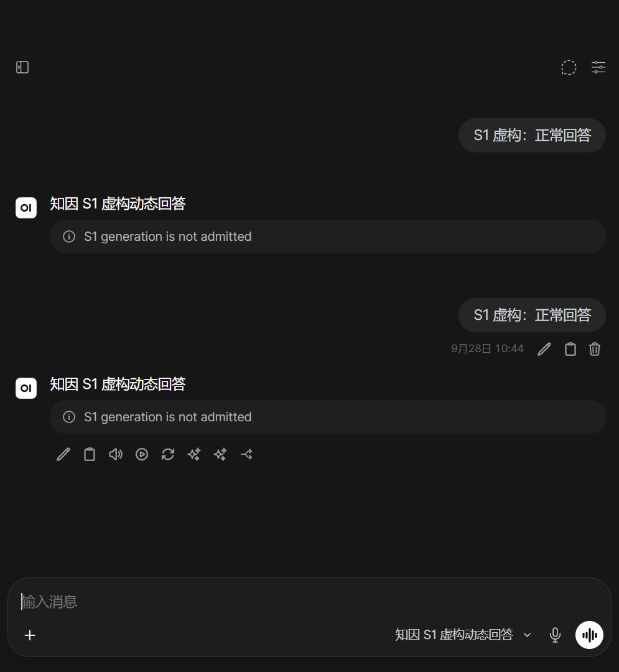
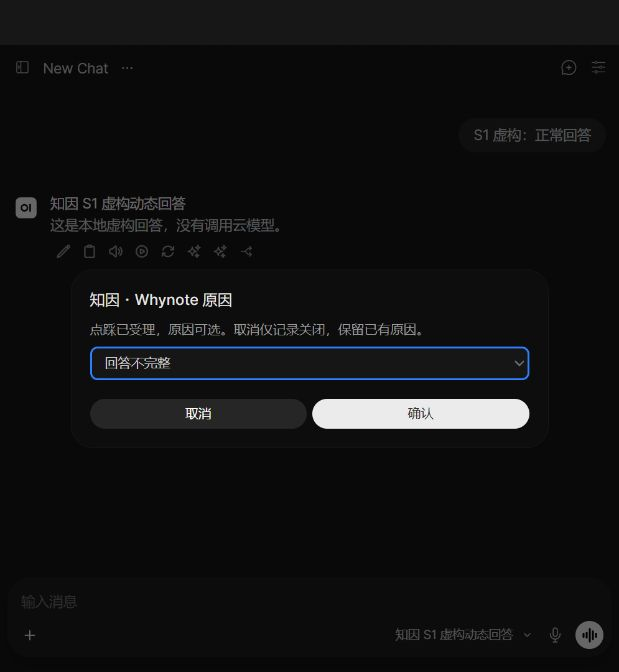

# S1-2 独立 QA：Q-23～Q-25 阻塞

日期：2026-09-28（Asia/Shanghai）。执行身份：独立测试代理；不是非作者 GitHub APPROVED，也不是责任人的结果签署。生产、真实云调用与完整 FR 继续 **NO-GO**。

## 1. 实际基线及集成状态

- 候选代码：PR #26 head `4825c9bb7e3a8ac8cd06b7783234591bd0fccc48`。QA checkout 为 `7a03f472d3130798ae17a4f57e8d5dcabfe90a52`，两者文件树完全一致。
- GitHub 实际状态：PR #26 于 2026-09-28 02:33:36 UTC 合并到 **`codex/s1-cloud-contract`**。PR #25 已于前一日合入 main，但其旧分支继续承接了 #26。main 仍是 `9859fce090e636664216dad9e2fcbf94605149c8`，**不包含 S1-2**。本 QA 没有执行这些合并。
- #26 的 CI `36304950220` 两项成功；最新 head 没有非作者 APPROVED。合并事实不补足评审与签署，也不能写成已交付到 main。
- 飞书读取基线：PRD **248**、技术文档 **237**。沿用已签 S1-1 v1；需求映射 FR-01/02/11/13/14、TD-04/06/10/15、D-13/15/17，以及 Q-11～Q-22 既有契约。
- 固定宿主 Open WebUI v0.11.4 / `8bd8b4fac5e059578ac0c74b3c18d11139f88b7d`，在新目录顺序应用 native、manual timing、S1 三个补丁。原生 fixture 以临时 Git index 验证完整补丁栈与实际源码相同。
- 浏览器使用开发已有的前端 build 副本；对应宿主修改文件逐个按 LF 归一化比对一致，index SHA256 为 `1114fbb1e13b22b8b8ba4e5d5752d5a1f9a1b80b8766af6c0e411b56139b14e7`。**本轮没有重新构建前端**，不声称独立构建通过。

## 2. 本轮实际执行

| 检查 | 本轮结果 | 范围与限制 |
| --- | --- | --- |
| 锁定依赖、重装当前 whynote 后 `pytest -q tests qa` | **199/199** | 包含既有 S0、Q-21/Q-22、S1 回执/预算/重试/否定路径；不是完整 FR 验收 |
| 三补丁实际宿主 `pytest integrations/openwebui/tests`（新增验收前） | **69/69** | 新虚构库、真实 ORM 和评分路由；身份/通知依赖按 fixture 替换，数据库与权限分支未替换 |
| Q-16 实际路由/数据库契约探针 | **58/58** | 本轮另建虚构库，管理员他人记录拒绝契约为 404；与原生套件存在重叠 |
| `qa.s1_http_probe` | **46/46** | 本轮新建 Alice/Bob，真实登录、HTTP、WebSocket 与 SQLite 对账；脚本来源是开发交付，本轮由 QA 独立运行；没有覆盖浏览器实际生成请求形状 |
| 新增 `test_s1_independent.py` | **0 通过 / 3 失败** | Q-23 的回答/父消息两条失败，Q-24 一条失败；严格预期保留，无 skip/xfail |
| Ruff check / format | **通过** | 新验收文件的 import 排序已修正 |
| 真实浏览器生成 | **失败：Q-25** | 新虚构 Alice 正常发送两次，均 403，页面显示 `S1 generation is not admitted` |
| 真实浏览器反馈菜单 | **指定子项通过** | 对通过 HTTP 正常生成并保存的另一条虚构回答，选因、更正、撤回成功；不是完整浏览器生成→反馈闭环 |

核心套件和原生套件有不同层次及重叠，不合计为完整验收覆盖率。Q-11～Q-22 的已覆盖回归通过，不消除本轮新缺陷。

## 3. 缺陷与证据

### Q-23 / P2：null 替换并恢复消息后旧回执复活

影响 D-13/17、FR-01/11/13、TD-04 的对象版本与编辑失效契约。位置 `src/whynote/s1_host.py:20` 的 `invalidate_edit`。

1. 创建属于虚构用户的聊天，完成正常生成回执并确认宿主保存。
2. 通过实际 `POST /chats/{id}`，分别把回答或其父消息的 history 值替换成 `null`。两条路径均返回 200；宿主将该消息归一化为缺失，ORM 读回确认已不是字典。
3. 再通过同一路由恢复原始完整 history，返回 200。
4. 使用真实 S1 Action 提交当前页面消息和新的点击 ID，回调选取本次签名选项。

**预期：**旧回执永久失效，拒绝反馈，事件/Outbox 零追加。

**实际：**两种目标均返回 `reason_submitted`；`s1_current=1`，追加 `negative_feedback_action_recorded → reason_displayed → reason_selected`，Outbox 增加 1。原因是非字典新值被比较逻辑跳过，恢复时旧消息已缺失，又被 `old is not None` 跳过。

新测试同时验证路由状态、ORM 读回和实际 Action/数据库副作用。没有把自动评审意见直接当作缺陷证据。首次探针对宿主 null 读回形状的假定被纠正为实际“归一化缺失”，**拒绝与零追加的验收断言未放宽**。

### Q-24 / P2：关闭试用使宿主保存钩子抛异常

影响 D-17 停止/回滚与 TD-04/10。位置 `src/whynote/s1_host.py:38` 的 `confirm_saved_response`。

1. 虚构生成完成，回执为 `awaiting_save`。
2. 将本测试配置设为 `enabled=false`，实际 ORM 最终保存回答成功。
3. 调用补丁使用的真实 `confirm_saved_response` 钩子。

**预期：**不再授予反馈资格，同时允许宿主继续收尾。

**实际：**`load_config` 抛出 `NotFoundError`；`status=awaiting_save`、`saved_at=null`。实际补丁将此调用放在 `clear_response_stream`、完成事件及响应 background cleanup 之前，该异常会跳过后续普通收尾路径。**本轮直接运行的是 ORM＋钩子；完整在途请求关闭时的 UI/清理事件未另做故障注入**，收尾控制流结论来自固定补丁源码。

### Q-25 / P1：标准浏览器聊天请求被 S1 边界全部拒绝

影响 S1-2 主路径、D-17、TD-04。位置 `src/whynote/s1_host.py` 的 `TrialBoundary`；固定上游 `Chat.svelte` 正常发送位置约第 3613 行。

1. 启动交付的 `qa/s1_browser_host.py`，全新虚构数据、默认参数、仅回环 mock provider；真实浏览器登录虚构 Alice。
2. 选用“知因 S1 虚构动态回答”，发送允许的固定文本 `S1 虚构：正常回答`。
3. 从浏览器 CDP 只提取该请求正文与响应状态，不读取或输出认证头。

**预期：**正常 UI 请求进入获准 Pipe，得到本地虚构回答；不允许额外模型/工具调用。

**实际：**两次均 HTTP 403、页面报 `S1 generation is not admitted`。标准前端带非空 `model_item`，并由默认配置产生 `features.memory=true`；边界两项均拒绝。主测试 HTTP 脚本省略这些字段，所以 46/46 不能覆盖此问题。浏览器两次发送没有创建生成回执；数据库总计 3 次均来自 HTTP（原探针 2 次＋菜单验证准备 1 次）。

修复应协调 UI 请求、启动配置与服务端可信模型解析，保留伪造模型/工具/记忆调用的拒绝；不能通过简单允许不可信 `model_item` 或开放 memory 出站来“修复”。

## 4. 浏览器菜单的独立证据

为继续验证不依赖 Q-25 的路径，用真实登录 HTTP 为 Alice 创建另一条正常回答，然后通过实际浏览器打开该聊天：

- 选择“事实有误”，再打开菜单更正为“回答不完整”，最后撤回点踩。
- SQLite 对应对象的顺序为：动作 → manual_menu 展示 → `reason_selected(factual_error)` → edit_menu 展示 → `reason_edited(incomplete)` → `action_retracted`，旧事件保留。
- 两次提交均记录 `client_reported` 主动耗时；这里只证明实际埋点落库，不证明用户研究计时指标完整验收。
- 未执行：该动态页面的并发旧菜单、完整 60 秒 UI 边界、浏览器重连重放、浏览器原生评分矩阵。相应服务器/HTTP 回归与 UI 证据分开。

## 5. 修复后复验与交付门槛

| 阻塞 | 责任与下一次条件 |
| --- | --- |
| Q-23 | 宿主/后端修复非字典替换、归一化缺失和恢复路径；本文件严格验收原样通过，并补删除/编辑/恢复与回调竞态 |
| Q-24 | 宿主/后端使关闭入口不破坏已保存响应的清理；保留费用审计，拒绝反馈资格；运行真实在途 HTTP/WebSocket 关闭演练 |
| Q-25 | 客户端/宿主完成标准 UI 请求与安全边界联调；从真实浏览器完成生成→反馈，继续验证旁路零调用 |
| main 缺少 S1-2 | 交付责任人准备正确目标 main 的集成，保留此次错误目标分支事实；不得用 feature 分支合并状态代替 main 验证 |
| 评审与签署 | 获得覆盖最终提交的非作者 APPROVED、适用结果签署；已有 S1-1 契约签署不需重签，但不代替新结果批准 |
| 真实试用 | 出站条款、环境级控制、限定试用准入、全部副本留存/删除演练仍缺；不启动真实云调用、语料采集、原因推断或 auto-attach |

本 QA 分支仅增加测试和报告，依赖 `codex/s1-cloud-contract` / `7a03f47`，评审 PR 以该分支为基线，避免把未经批准的业务集成混入 QA 变更。新增失败测试用于阻止误合并，CI 失败不作豁免；业务修复后重跑，不能删除或降低断言。

本地原始记录在 QA 工作树 `var/qa-s1-independent/`：`native.log/xml`、`boundaries.log/xml`、`http-results.json`、`browser-request.json`、`browser-events.json` 与本轮虚构库。分享版不包含 private/trial 配置、密码、token 或认证头。原工作目录的既有修改、旧分支与历史审计库全部保留。

## 6. 文档同步与收尾

- [PRD](https://my.feishu.cn/wiki/XG6SwutL0i3fyWkwmhScEEB86Gg) **248 → 250**、[技术文档](https://my.feishu.cn/wiki/GuphweJs3iWwBRkBDjlcljA16bh) **237 → 241**。按每次新读取的 revision-id 局部替换原 S1-2/当前工程条目，逐次读回复核；历史归档逐字不变，已有链接全部保留。
- QA 草稿 [PR #27](https://github.com/262412/-Whynote/pull/27)；仅测试、证据与文档。严格失败用例等待业务修复，不批准合并。CI 以 GitHub 当前 head 检查结果为准，不将本地已知失败宣称绿色。
- [机器可读结果](qa-s1-evidence/results.json) 只保存本轮虚构结果和计数。两个临时服务（8126/8127）已停止，浏览器临时标签已关闭；全新证据库保留供修复复验。
- 原工作目录收尾状态与开工一致。QA 工作树/分支因开放缺陷与未合并 PR 保留；宿主/后端/客户端修复完成、非作者评审和签署后，再核对正确 main 集成与引用清理。
