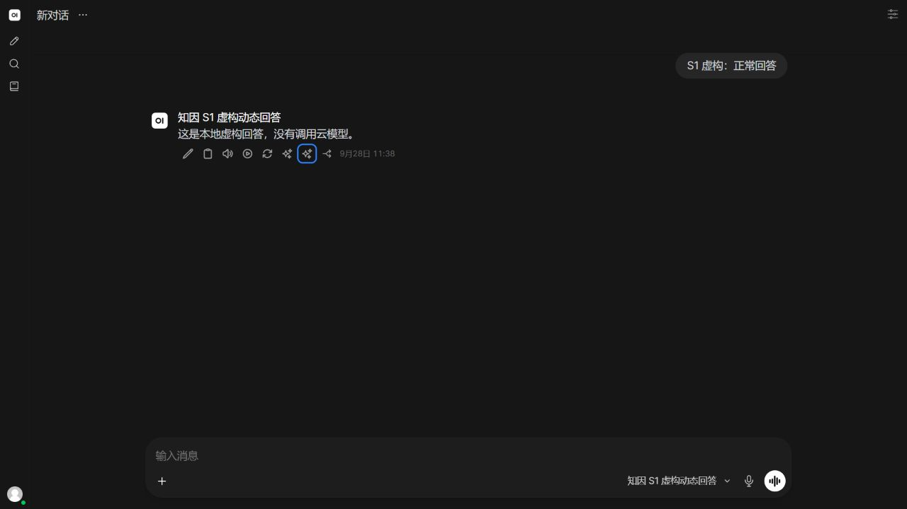

# Q-23～Q-25 独立复验（2026-09-28）

测试业务提交：PR #27 `a4a0614743a042de6625bacf1be228ba180803f2`；目标 main 正确，尚未合并。main 仍为 `9859fce090e636664216dad9e2fcbf94605149c8`。开工 CI `36373276581` 两项成功，review 为空。读取飞书 PRD 255 / 技术文档 248。对应 FR-01/02/11/13/14、TD-04/10/15、D-13/15/17。

结论：**Q-23～Q-25 的下列技术子项独立通过；完整验收、非作者批准、结果签署和生产仍 NO-GO。** [上一轮失败](qa-s1-independent.md)原样保留。

## 执行结果

| 范围 | 本轮实测 | 证据与边界 |
| --- | --- | --- |
| 核心及既有 QA | 209/209 | 锁文件重装当前包后 `pytest -q tests qa`；含 Q-21/Q-22 回归 |
| 实际宿主原生回归 | 72/72 | 全新虚构 SQLite；包括上一轮三条严格独立断言，文件未修改 |
| 浏览器形状 HTTP/WebSocket | 47/47 | 新 Alice/Bob 真实登录、同模型元数据丢弃、事件对账、其他主体拒绝和重试 |
| Ruff | check / format 通过 | 本轮未修改业务代码 |
| 实际浏览器 | 生成→选因→更正→撤回四个请求均 200 | 从页面正常发送开始，无 HTTP 代替浏览器生成；数据仅允许的虚构 fixture |
| 在途停用 | 业务子项通过；原探针未全部通过 | 详见下节，不能写成探针整体绿色 |

固定宿主 v0.11.4 / `8bd8b4fac5e059578ac0c74b3c18d11139f88b7d`；新目录 `var/qa-s1-fixed-upstream` 顺序应用三补丁。原生 fixture 用临时 index 校验整个补丁栈。前端复用开发 build 副本，修改源码经 LF 归一化比对；index SHA256 `c626116d12378da222472c366b61bbbf0ef74337e1f17101c1f95fd66b6bb9aa`。本轮没有重建前端。

## Q-23：对象替换/恢复

原样运行真实路由 POST、ORM 读回及 Action 用例，分别把回答/父消息设 null 后恢复；现均拒绝提交，当前回执 0、事件 0、Outbox 0。额外 history 为 null/缺 messages/非字典的既有回归通过。以前的 3 事件与 1 Outbox 非法副作用未再出现。

## Q-24：在途停用

本轮仅启动回环虚构 provider 和全新宿主，没有真实密钥或出站。此前开发轮的 `blocked by policy` 是历史未执行证据；本轮启动成功，不代表解释或绕过了其审批原因。

1. 原样执行开发 `qa/s1_shutdown_probe.py`，在读取 `response.json()` 时失败；未到停用动作。缺少标准宿主新聊天的 `parent_id: null`，响应不走预期后台任务 JSON 路径。本轮只补该请求前置字段，不改业务代码。
2. 保留首次日志，再执行；模拟 provider 发出首块后等待 gate，探针写本轮配置 `enabled=false`，释放 provider 完成响应。
3. 实际回答保存为 done、无 error，WebSocket 最终 done 事件到达。回执 `awaiting_save`、`saved_at=null`；这些断言在后续失败前已通过。
4. **原探针在 `s1_current` 行数应为 0 的断言失败：实际 1。该断言没有删除、skip 或降低，失败日志保留。** 此表是候选索引；资格查询还要求 completed 与 saved_at。冻结契约要求“不提升候选、不授予反馈资格、保留费用”，没有要求删除候选索引。该差异作为开发探针口径问题列出，须维护者核对，不虚构新的越权结论。
5. 另外执行独立读回与真实登录反馈请求：有效回执 0，预留 **4,008,192 micro-CNY**、未结算；反馈 **400**，全部事件前后相同。此补充验证不把原探针改记为通过。

剩余：开发探针的索引断言需与契约对齐；未验证全部异常关闭/存储失败、跨进程清理或重新准入流程。正常在途停用的保存、完成事件、候选不升级、费用保留与拒绝零追加有本轮实测。

## Q-25：浏览器闭环

用新虚构 Alice 从真实页面发送 `S1 虚构：正常回答`，得到固定回环回答。选择“事实有误”，更正为“回答不完整”，撤回；四个真实页面请求均 200。

数据库同对象顺序严格为：`negative_feedback_action_recorded → reason_displayed → reason_selected(factual_error) → reason_displayed → reason_edited(incomplete) → action_retracted`。当前正常生成回执保持有效，没有因为反馈回写聊天而失效。既有拒绝测试仍覆盖 other/direct model_item、memory/web_search、工具、文件等旁路。

## 证据与交付

原始日志、JUnit、虚构数据库和关闭状态在 `var/qa-s1-retest-20260928/`；[浏览器网络](qa-s1-retest-evidence/browser-http.json)、[事件](qa-s1-retest-evidence/browser-events.json)、[停用读回](qa-s1-retest-evidence/shutdown-readback.json)可评审，不含认证头或密钥。服务已停止、临时标签关闭；原目录修改与旧证据保留。

另一个切片 PR #28 / `4b57439` 的独立验证使用该提交的干净 Git archive、独立虚拟环境；234/234 历史套件通过，新增 Noul null 响应检查 4 通过/2 失败，登记 Q-26。它不改变本报告 S1 技术结论，也不表示 Jev 获准真实调用。

非作者 APPROVED、责任人结果签署、真实运行准入、供应商条款与环境级出站控制、全部副本处置仍缺。本 QA 不合并，不启用真实云/原因推断/auto-attach，也不替用户追认完整 FR。
